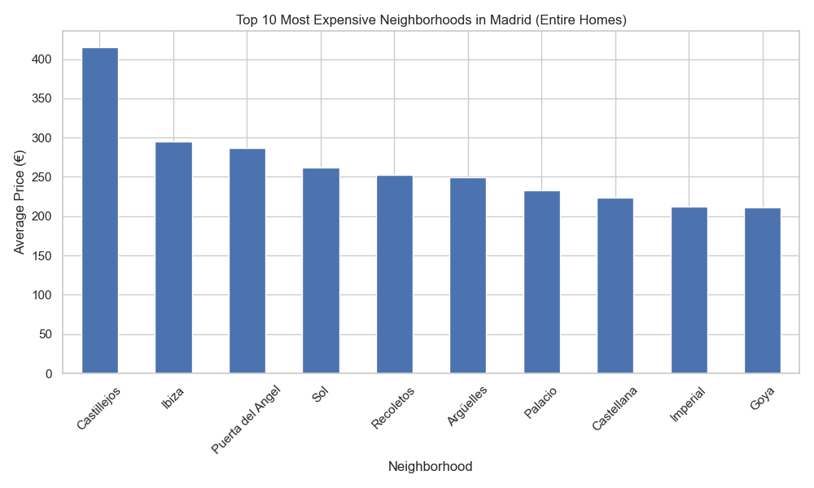

# Madrid Airbnb Data Analysis

## Overview
This project analyzes Airbnb listings in Madrid to identify which neighborhoods have the highest prices for entire home rentals.

The analysis focuses on understanding price distribution across neighborhoods while ensuring statistical reliability through data cleaning and filtering.

## Dataset
Source: Inside Airbnb – Madrid listings dataset.

## Project Structure

madrid-airbnb-data-analysis
│
├── data 
│   └── listings.csv
│
├── notebook
│   └── madrid_airbnb_analysis.ipynb
│
├── outputs
│   └── top10_airbnb_prices_madrid.png
│
├── requirements.txt
├── README.md
└── .gitignore

### Folder Description

- **data/**: raw dataset used in the analysis  
- **notebook/**: Jupyter notebook containing the full analysis workflow  
- **outputs/**: generated visualizations from the analysis  
- **requirements.txt**: Python dependencies required to run the project  

## Methodology
The analysis followed these steps:

- Data loading and exploration
- Data cleaning (handling missing values)
- Filtering listings to include only **entire home/apt**
- Aggregating average prices by neighborhood
- Filtering neighborhoods with fewer than 100 listings to improve statistical reliability
- Ranking neighborhoods by average price
- Creating visualizations

## Key Insights

- Central neighborhoods such as **Sol, Palacio, and Recoletos** show consistently high Airbnb prices.
- Areas within the **Salamanca district** (Recoletos, Goya, Castellana) appear among the most expensive for entire homes.
- Tourist-heavy neighborhoods combine **high prices and high listing density**.
- Filtering neighborhoods with small sample sizes significantly improves the reliability of the analysis.

## Visualization

Top 10 most expensive neighborhoods for Airbnb entire homes in Madrid:

## Tools Used

- Python
- Pandas
- Matplotlib
- Jupyter Notebook

## Future Improvements

Possible extensions of this analysis:

- Compare **Airbnb prices vs long-term rental prices**
- Analyze **price distribution (median vs mean)**
- Investigate **seasonality in availability**
- Build an **interactive dashboard**
