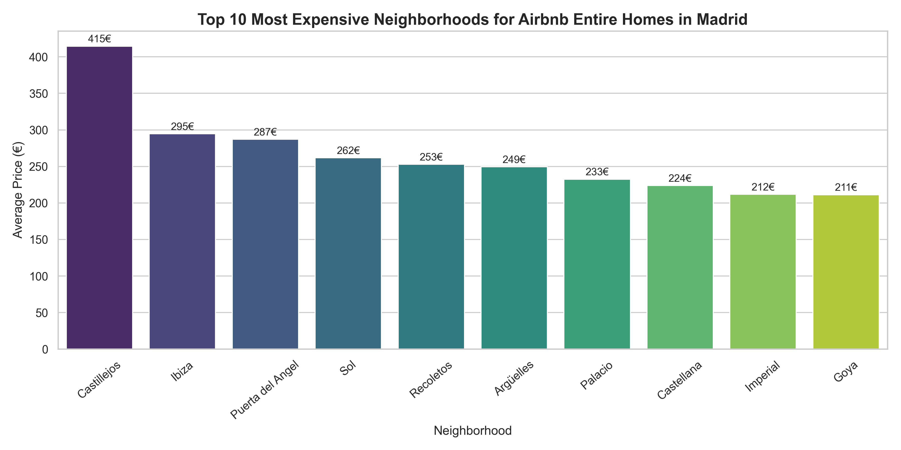

# Madrid Airbnb Data Analysis

Exploratory data analysis of Airbnb listings in Madrid using Python to identify the most expensive neighborhoods for entire home rentals.



---

## Overview

This project analyzes Airbnb listings in Madrid to understand price patterns across neighborhoods, focusing specifically on **entire home rentals**.

The goal is to identify which areas of the city have the highest average prices while ensuring the analysis remains statistically reliable.

---

## Objective

The main objectives of this analysis were:

- Clean and prepare the Airbnb dataset
- Filter listings to include only **entire homes**
- Aggregate prices by neighborhood
- Remove neighborhoods with small sample sizes
- Identify the **most expensive areas for Airbnb rentals**
- Visualize the results clearly

---

## Dataset

Source: **Inside Airbnb – Madrid listings dataset**

The dataset contains information about Airbnb listings including:

- Neighborhood
- Price
- Room type
- Number of reviews
- Availability

For this project, the analysis focuses on **entire home listings** to ensure fair comparisons between properties.

---

## Methodology

The analysis followed these steps:

1. Data loading and exploration
2. Data cleaning and preprocessing
3. Handling missing values
4. Filtering listings by **room type (entire home)**
5. Aggregating prices by neighborhood
6. Filtering neighborhoods with fewer than **100 listings**
7. Ranking neighborhoods by average price
8. Creating visualizations

---

## Key Insight

Central neighborhoods such as **Sol, Palacio, and Recoletos** consistently appear among the most expensive areas for Airbnb entire home rentals.

Tourist-heavy areas tend to combine:

- **high listing density**
- **higher average prices**

This reflects the strong demand for short-term rentals in Madrid's city center.

---

## Tools Used

- Python
- Pandas
- Matplotlib
- Seaborn
- Jupyter Notebook

---

## Project Structure

```
madrid-airbnb-data-analysis
│
├── data 
│   └── listings.csv
│
├── notebook
│   └── madrid_airbnb_analysis.ipynb
│
├── outputs
│   └── top10_airbnb_prices_madrid.png
│
├── requirements.txt
├── README.md
└── .gitignore
```

---

## Folder Description

- **data/** → raw dataset used in the analysis  
- **notebook/** → Jupyter notebook containing the full analysis workflow  
- **outputs/** → generated visualizations from the analysis  
- **requirements.txt** → Python dependencies required to run the project  

---

## Future Improvements

Possible extensions of this analysis include:

- Comparing **Airbnb prices vs long-term rental prices**
- Analyzing **price distributions (median vs mean)**
- Investigating **seasonality in availability**
- Building an **interactive dashboard**